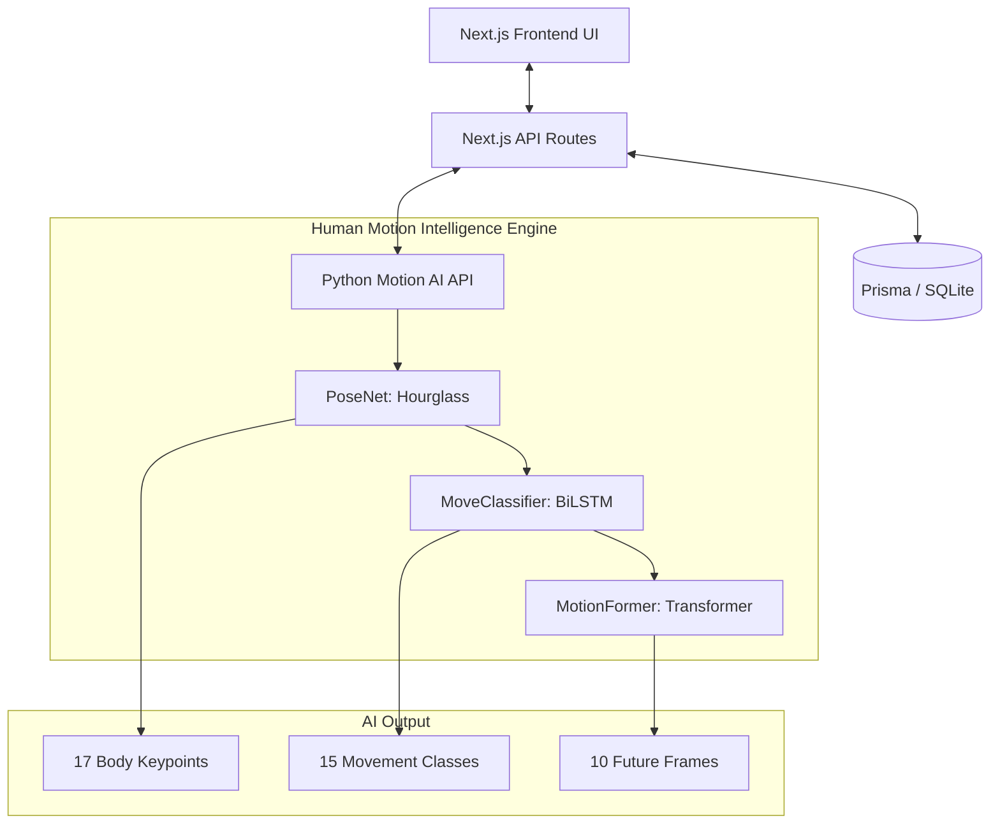
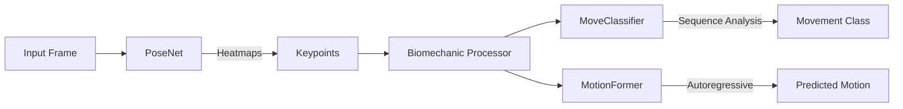
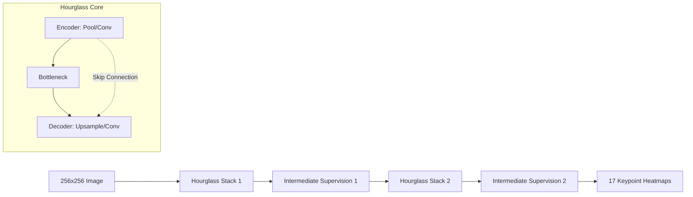
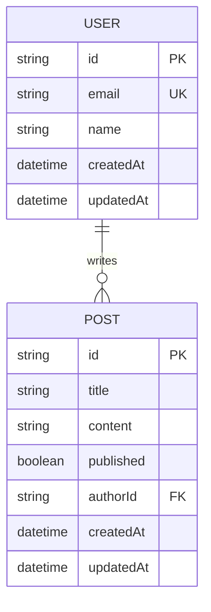
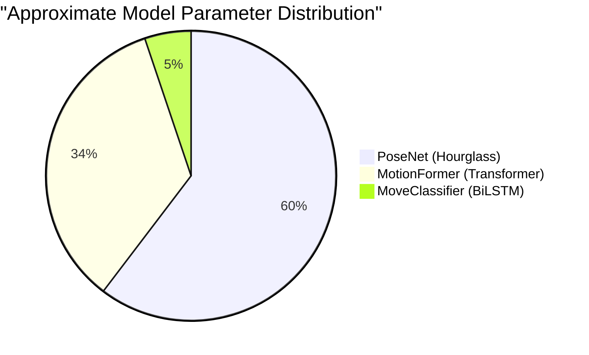
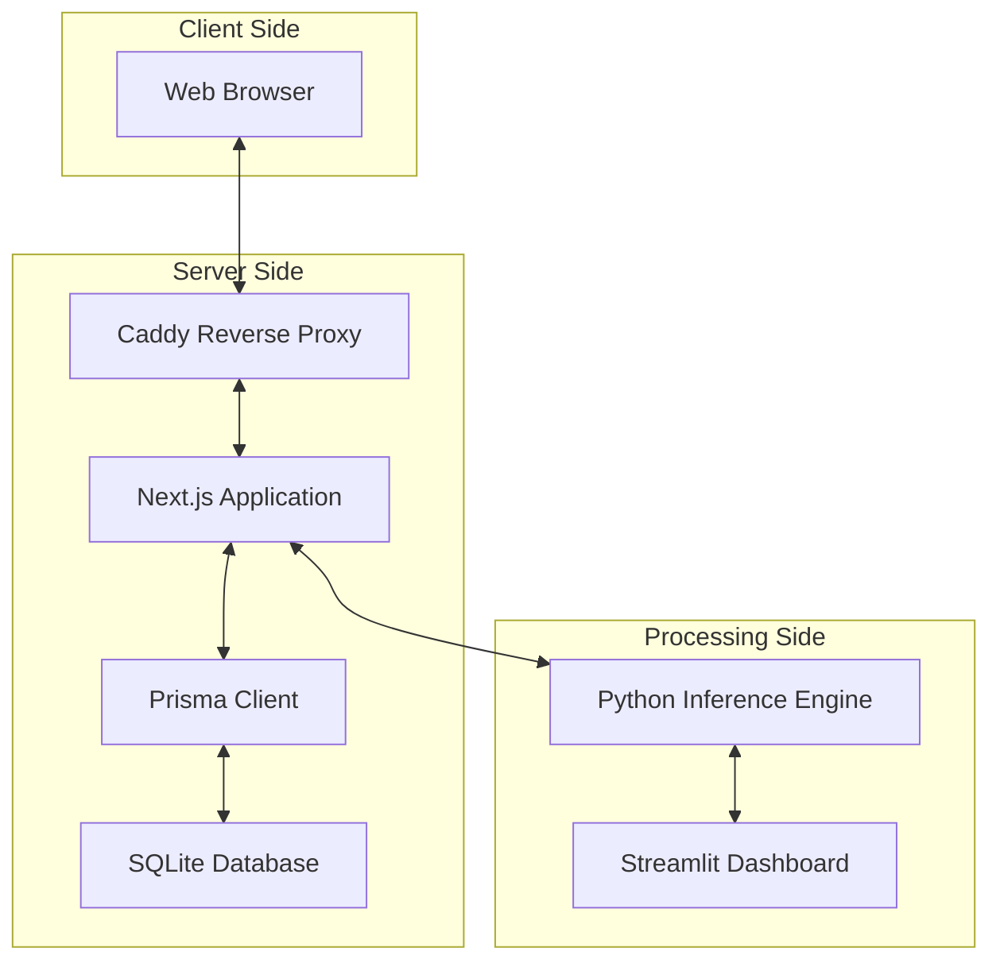

# 🏃 Motion Engine by Selma Haci

##  System Architecture

##  AI Pipeline Details

##  PoseNet Architecture (Stacked Hourglass)

##  Database Schema

## Model Parameters Summary

##  Deployment Structure

