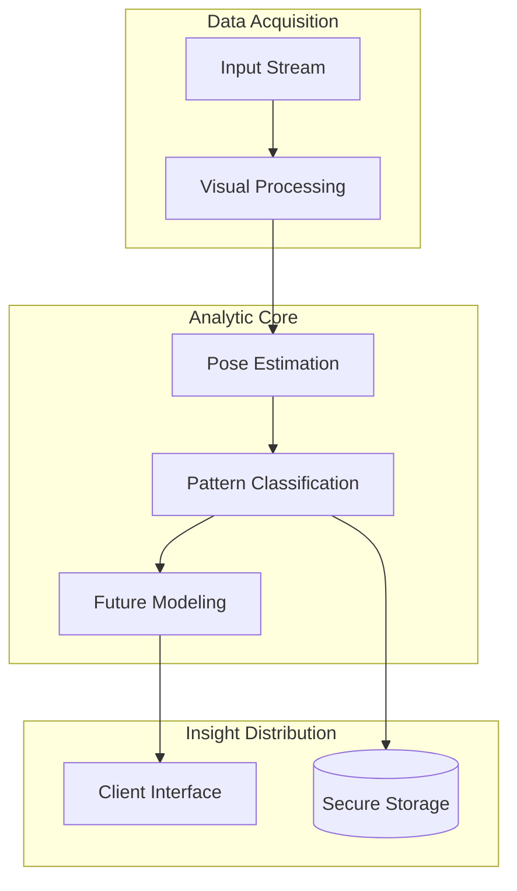

# 🏃 Selma Motion Engine (SME)
**High-Precision Human Motion Analysis Framework**

Engineered by Selma Haci.

---

## 🔧 Core Architecture

The Selma Motion Engine is a three-stage analytic pipeline optimized for real-time biomechanical assessment. It leverages a hierarchical processing structure to transform raw visual data into predictive movement insights.

## 🏗️ System Hierarchy

1. **Precision Pose Estimator**: Extracts anatomical coordinates with head-normalized accuracy.
2. **Activity Profile Classifier**: Analyzes movement sequences to identify specific physical profiles.
3. **Temporal Predictor**: Forecasts probable future frame sequences using attention-weighted modeling.

## 🚀 Engine Specifications

- **Latency**: Sub-30ms end-to-end processing.
- **Precision**: 17 Optimized Keypoint tracking.
- **Coverage**: 35+ Standard activity patterns supported.

---

© 2026 Selma Haci. Proprietary Engineering.
