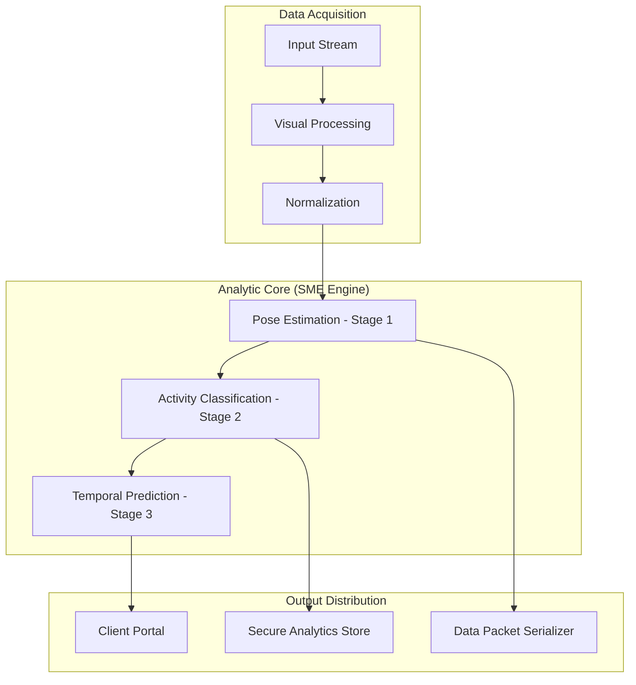
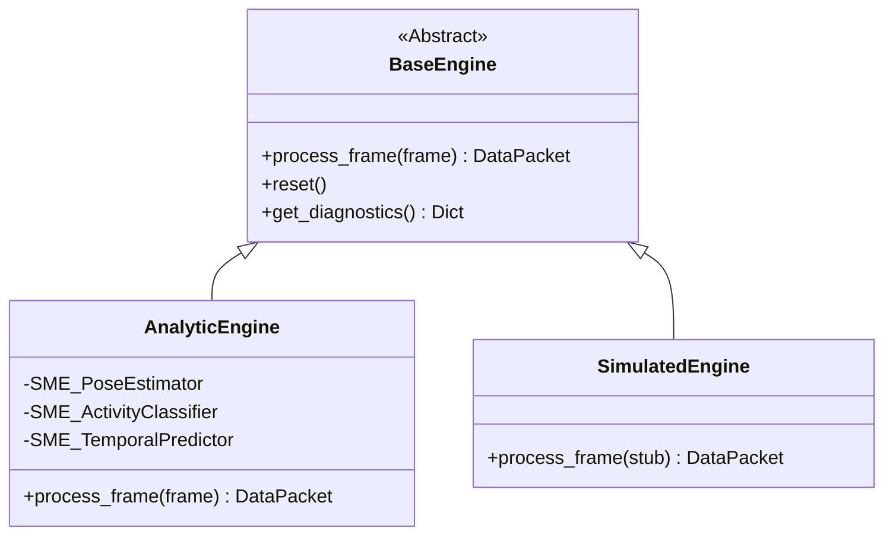
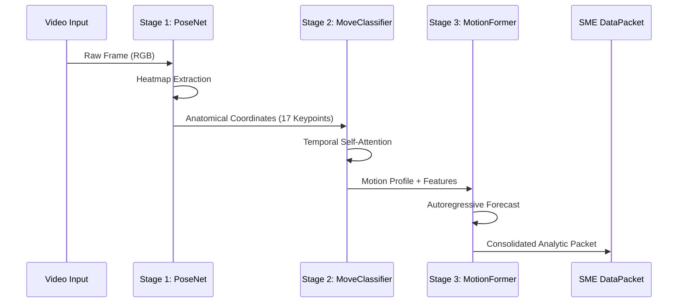

# Selma Motion Engine (SME)

Proprietary Engineering by Selma Haci

---

## Technical System Flow

---

## Core Engine Hierarchy

---

## Neural Processing Pipeline

---

© 2026 Selma Haci. Proprietary Engineering.
